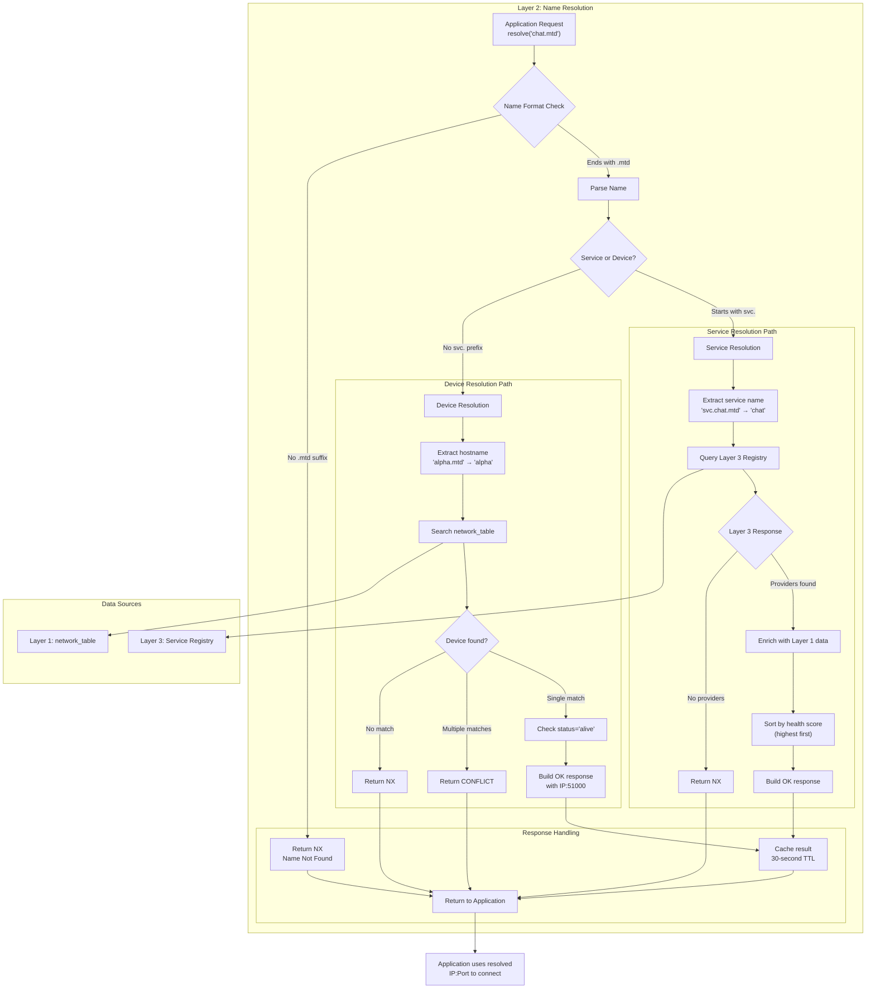
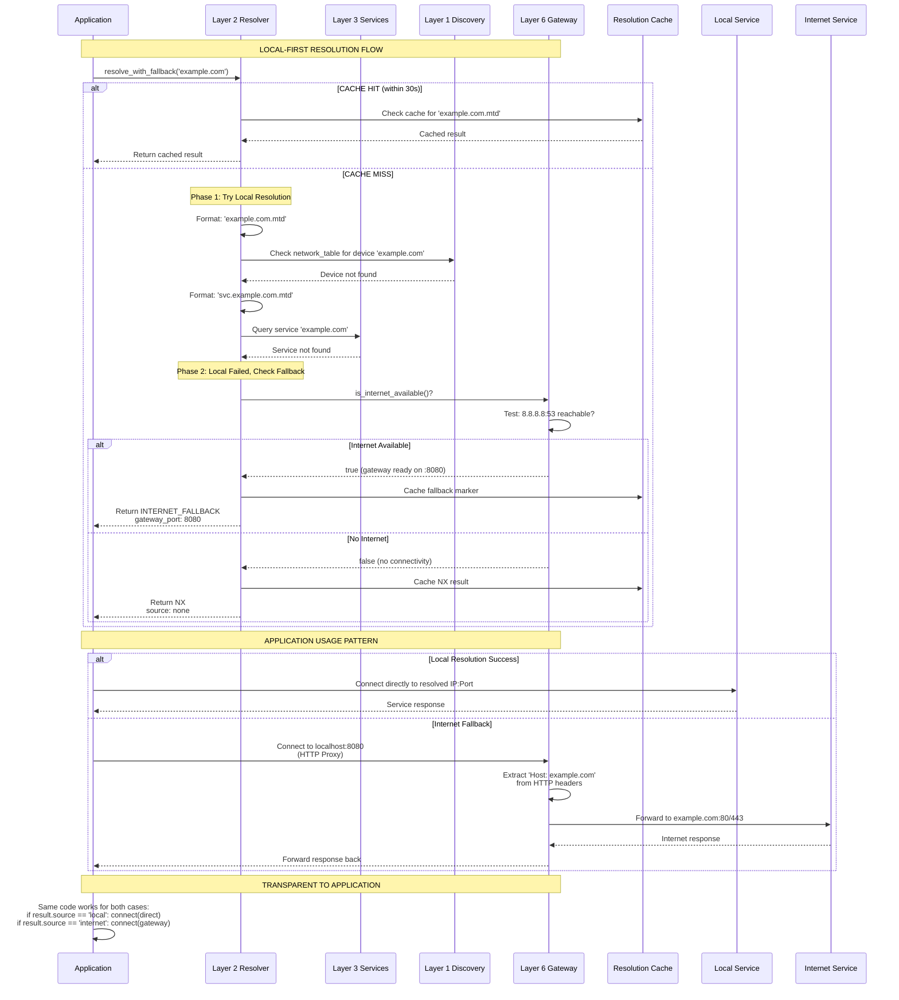
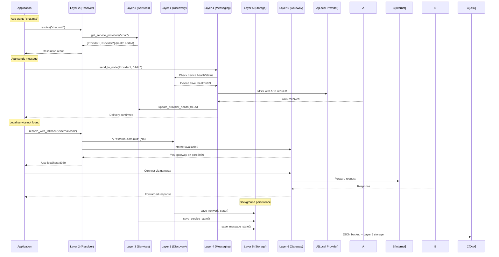
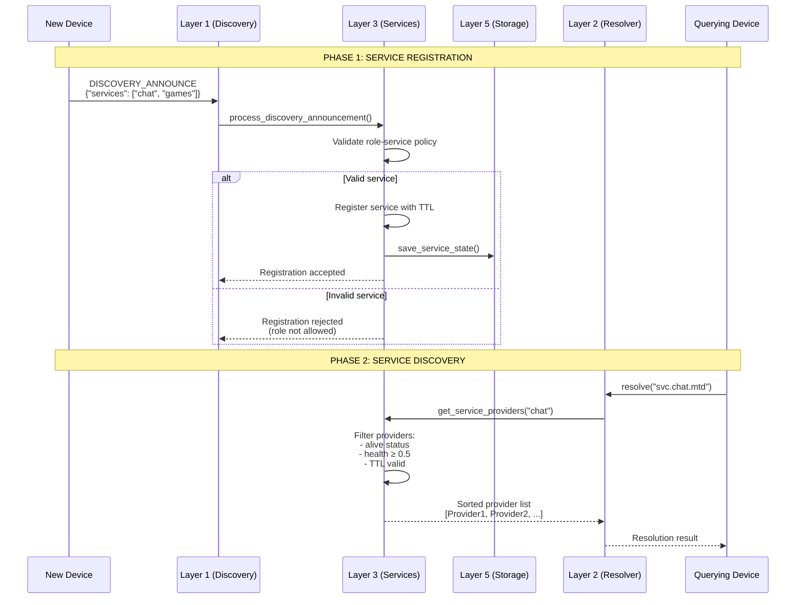
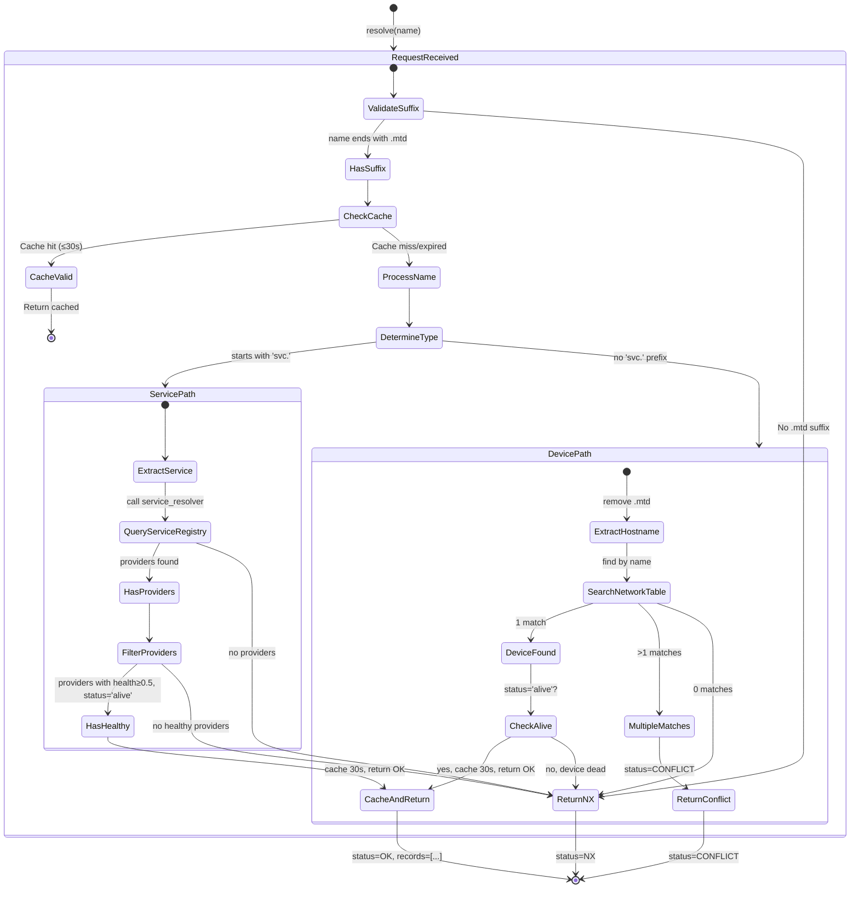
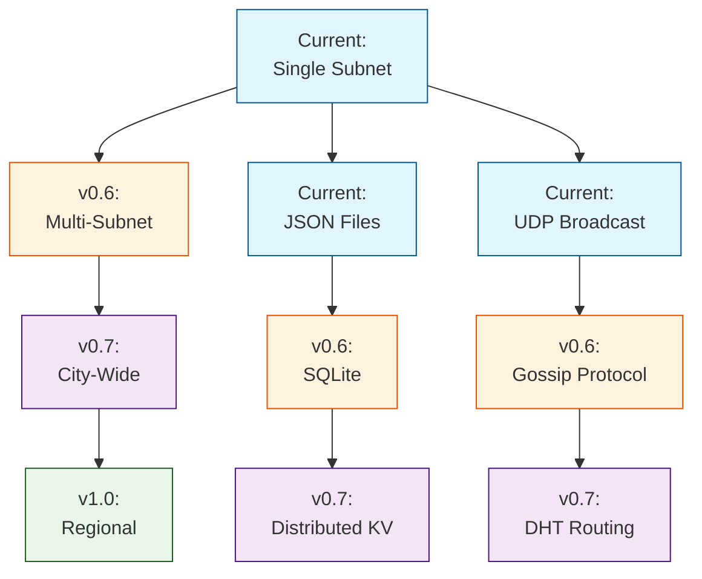

 ## 1. Executive Summary
### LocalMTD Architecture

This document describes the technical architecture of LocalMTD, 
a 6-layer peer-to-peer protocol stack for creating resilient local networks.
The system enables device discovery, service advertising, and communication
without internet connectivity, with intelligent fallback when available.

The NETWORK is layered, trust-aware, local-first distributed systems framework designed to operate primarily on a LAN or mesh network, with optional controlled internet egress. The system emphasizes:

    -Zero central coordinator # for now
    -Role-based trust and authority
    -Deterministic local resolution and routing
    -Gradual escalation from local → internet
    -Persistence and warm restart at critical layers

## 2. System Overview
### 🎯 2.1 System Goals
```
- **Offline-First**: Primary operation without internet
- **Local Scale**: 10-100 nodes in initial deployment  
- **Extensible**: Can grow to 10,000+ nodes with clustering
- **Resilient**: Survives network partitions and node failures
- **User-Friendly**: Simple .mtd addressing (chat.mtd, files.mtd)
```
### 2.2 Core Design Principles
````
1) Layered Isolation –Each layer has strict responsibilities and non-responsibilities.

2) Local-First – All operations attempt local resolution and delivery before fallback.

3) Role Trust Discipline – Nodes declare roles once; roles are immutable at runtime.

4) Health-Aware Networking – Node reliability is continuously scored and enforced.

5) Authoritative vs Derived State – Only selected layers persist authoritative truth.

6) Crash Survivability – Warm restart without full network rediscovery.
````
## 3.🏗️ Layer Stack Overview
```
┌─────────────────────────────────────┐
│ Layer 6: Internet Fallback Protocol │
├─────────────────────────────────────┤
│ Layer 5: Local Storage Protocol     │
├─────────────────────────────────────┤
│ Layer 4: Local Messaging Protocol   │
├─────────────────────────────────────┤
│ Layer 3: Local Service Protocol     │
├─────────────────────────────────────┤
│ Layer 2: Local DNS Protocol (.mtd)  │
├─────────────────────────────────────┤
│ Layer 1: Local Discovery Protocol   │
└─────────────────────────────────────┘
Layer Who Owns What
1	Who is on the network
2	What name maps to what address
3	What services exist
4	How messages are delivered
5	How state is stored
6	How internet is used

## DEEPER DIVE ##
Layer 1 — Discovery Protocol 
- Device presence
- UUID, name, IP
- Role declaration
- Network table population
- Heartbeats / liveness

Layer 2 — Naming / Resolution Protocol (Local DNS equivalent)
- Resolve human-readable names → devices / services
- Example:
    chat.mtd → device IP + service port
    cache.mtd → cache node(s)
- No messaging logic
- No service semantics
- Pure name → address mapping

Layer 3 — Service Protocol
- What services a node provides
- Service discovery (who provides X?)
- Versioning, health, load hints

Layer 4 — Messaging Protocol 
- Direct messaging
- ACKs, retries, timeouts
- Routing via resolved names

Layer 5 — Storage Protocol


Layer 6 — Internet Fallback
- Exit local mesh when needed
- Hybrid local + internet routing
```

## 4. Layer 1: Local Discovery Protocol
🎯 Purpose

Layer 1 automatically finds all devices on the local network so higher layers can communicate with them.

```
📍 Position in Stack

Layer 1: Finds devices ← **HERE**
Layer 2: Resolves names (.mtd)
Layer 3: Tracks services
Layer 4: Sends messages

```


Layer 1 establishes who exists on the local network.

Key Responsibilities

    - UDP broadcast-based discovery

    - Identity announcement

    - Role declaration

    - Liveness detection

Key Files

    - discover.py

    - network_table.py

    - allowed_roles.py

Protocol

    - Periodic DISCOVERY_ANNOUNCE packets over UDP broadcast

    - Passive listening on a fixed discovery port

    - Network Table

The 📦 network table is the canonical in-memory representation of known nodes:
```
{
  "device_id": {
    "ip": "string",
    "name": "string",
    "role": "string",
    "role_trusted": true,
    "last_seen": float,
    "status": "alive|dead|unhealthy",
    "health": float
  }
}
```

Role Enforcement

    - Roles must exist in ALLOWED_ROLES

    - First observed role is authoritative

    - Runtime role changes are rejected

Persistence: network_state.json

    - Network table is periodically persisted

    - Enables warm restart without rediscovery storms

🔄 Three Concurrent Loops (All Required)

1. Announce Loop - "I exist"
```
while True:
    broadcast("ANNOUNCE: device_abc")
    sleep(5)  # Every 5 seconds
    
Purpose: Tell the network you're alive
```
2. Listen Loop - "I hear you"
```
while True:
    message = udp_listen()
    if "ANNOUNCE" in message:
        add_to_table(sender_ip, device_id)
        
Purpose: Hear other devices announcing
```
3. Cleanup Loop - "You're gone"
```
while True:
    sleep(60)  # Every minute
    remove_devices_not_seen_for(120)  # 2 minutes
    
Purpose: Remove dead devices automatically
```

🚀 What Happens When:
```
Device Starts:
    - Immediately broadcasts "I'm here"
    - Starts listening for others
    - Within seconds, knows about nearby devices

Device Crashes:
    - Stops broadcasting
    - Others notice no announcements for 2 minutes
    - Cleanup loop removes it automatically
    - No "goodbye" needed

New Device Joins:
    - Broadcasts immediately
    - Everyone hears it
    - Added to all tables instantly
```

⚙️ Simple Configuration
```
# discovery.py constants

ANNOUNCE_INTERVAL = 5    # Say "I'm alive" every 5s
CLEANUP_INTERVAL = 60    # Check for dead devices every minute
DEVICE_TIMEOUT = 120     # Mark dead after 2 minutes silence
BROADCAST_PORT = 51000   # Where everyone listens
```

🎨 Announce Message Format
```
ANNOUNCE|device_abc|game|timestamp
    - | separated for easy parsing
    - Contains: device_id, role, timestamp
    - Sent via UDP broadcast
```
```
⚠️ What It Doesn't Do
    ❌ No authentication (yet)
    ❌ No service discovery (Layer 3)
    ❌ No message delivery (Layer 4)
    ❌ No persistence yet
    ❌ No central server yet

🔧 Files 

mtd_network/
├── discovery.py           ← **MAIN FILE** (has all 3 loops)
├── network_table.py       ← Stores device info in memory
└── ... (higher layers use these)

💡 Key Insight
Every device runs the same code. No special nodes. If you run it on 5 laptops,
they all find each other automatically.
```

🛠️ For Developers
```
# To check who's online:
    from network_table import get_devices
    devices = get_devices()  # Returns {device_id: {ip, last_seen, role}}

# To get a specific device:
    device_info = get_device("device_abc")
    
# Higher layers use this to find each other

```

⚡ Performance Notes
```
    - Lightweight:Just UDP packets every 5 seconds
    - No blocking: All loops run concurrently
    - Self-healing: Dead devices auto-removed
    - No configuration: Just run it
```
Layer 1 (Discovery) - Architecture Diagram
```
text
┌─────────────────────────────────────────────────────────┐
│                    LAYER 1: DISCOVERY                   │
├─────────────────────────────────────────────────────────┤
│                                                         │
│  ┌─────────────┐       Broadcast       ┌─────────────┐ │
│  │   Device A  │ ────────────────────> │   Device B  │ │
│  │             │   DISCOVERY_ANNOUNCE  │             │ │
│  └─────────────┘   every 5 seconds     └─────────────┘ │
│         │                                              │
│         │  Listen on port 37020                        │
│         │                                              │
│  ┌──────┴──────┐                            ┌──────┴──────┐ │
│  │  announce_  │                            │   listen_   │ │
│  │   loop()    │                            │   loop()    │ │
│  │  (Thread 1) │                            │  (Thread 2) │ │
│  └─────────────┘                            └─────────────┘ │
│         │                                              │
│         │  update_network_table()                      │
│         ↓                                              ↓
│  ┌─────────────────────────────────────────────────────┐ │
│  │              NETWORK TABLE (Shared)                 │ │
│  │  ┌─────────────────────────────────────────────┐   │ │
│  │  │ device_id: {                                │   │ │
│  │  │   "name": "DeviceA",                        │   │ │
│  │  │   "ip": "192.168.1.10",                     │   │ │
│  │  │   "role": "game",                           │   │ │
│  │  │   "status": "alive",                        │   │ │
│  │  │   "health": 0.9,                            │   │ │
│  │  │   "last_seen": 1234567890.123,              │   │ │
│  │  │   "services": ["games"]                     │   │ │
│  │  │ }                                            │   │ │
│  │  └─────────────────────────────────────────────┘   │ │
│  └─────────────────────────────────────────────────────┘ │
│         │                                              │
│         │  Auto-save every 5 seconds                   │
│         ↓                                              │
│  ┌─────────────┐                            ┌─────────────┐ │
│  │ network_    │                            │ state_      │ │
│  │ state.json  │                            │ maintenance │ │
│  │ (Backup)    │                            │ _loop()     │ │
│  └─────────────┘                            │ (Thread 3)  │ │
│                                              └─────────────┘ │
└─────────────────────────────────────────────────────────┘
```

## **5. Layer 2: Local DNS Protocol (.mtd)**

🎯 Purpose

Layer 2 provides DNS-like name resolution for the MTD network, mapping
human-readable names to network addresses without scanning the network.

Components:

    - resolver.py: .mtd name resolution service

    - role_routing.py: Role-based message routing

Layer 2 answers: "Where should this name go?"

Layer Responsibilities
```
Layer	What It Does	            What It Doesn't Do
1	Finds devices on network	    Knows about services
2	Resolves .mtd names	            Register services or modify network table
3	Registers services	            Deliver messages
4	Delivers messages with ACKs	    Store state
```
Resolution States: OK, NX (Name does not exist), CONFLICT

Name Types Supported
1. Device Names

    Format: node-name.mtd

    - Resolves to a single physical device that is alive

    - Example: alpha.mtd → 192.168.1.10:51000


2.  Service Names

    Format: svc.service-name.mtd

    - Resolves to one or more providers offering the service

    - Must start with svc. prefix

    - Example: svc.chat.mtd → multiple devices offering chat service

Resolution Flow

For Device Names (alpha.mtd):
```
1. Parse: "alpha.mtd" → hostname="alpha"
2. Query: network_table for devices where name="alpha" AND status="alive"
3. Return: {"type": "device", "ip": "...", "port": 51000}
```

For Service Names (svc.chat.mtd):
```
1. Parse: "svc.chat.mtd" → service="chat"
2. Query: network_table for devices where "chat" in services list AND status="alive"
3. Return: {"type": "service", "providers": [...]}
```

Important Constraints
```
✅ NO NETWORK SCANNING: Layer 2 only queries existing data
✅ NO ROUTING DECISIONS: Layer 2 returns all valid providers
✅ HEALTH AWARE: Automatically filters out dead/unhealthy nodes
✅ NO BROADCASTS: Pure lookup, no network queries
✅ CACHED RESULTS: 30-second TTL for performance
```

Data Sources

From Layer 1 (network_table):
```
{
    "device_id": "...",
    "name": "alpha",
    "ip": "192.168.1.10",
    "status": "alive",  # or "dead"
    "services": ["chat", "games"],  # List of offered services
    "service_port": 5000  # Service announcement port
}
```
Resolution Output

Device Resolution:
```
{
    "status": "OK",
    "type": "device",
    "name": "alpha.mtd",
    "records": [
        {
            "device_id": "abc123",
            "name": "alpha",
            "ip": "192.168.1.10",
            "port": 51000,
            "role": "game",
            "role_trusted": true
        }
    ]
}
```

Service Resolution:
```
{
    "status": "OK",
    "type": "service",
    "name": "svc.chat.mtd",
    "records": [
        {
            "device_id": "abc123",
            "name": "alpha",
            "ip": "192.168.1.10",
            "port": 5000,
            "role": "game",
            "role_trusted": true
        }
    ]
}
```

Edge Cases Handled
```
✅ Names without .mtd suffix → NX (Name does not exist)
✅ Unknown device names → NX response
✅ Dead providers → Filtered out automatically (status != "alive")
✅ Duplicate device names → CONFLICT status returned
✅ Multiple service providers → All returned in records list
✅ Service prefix required → svc. prefix mandatory for services
```

What Happens Next
```
Layer 4 (Messaging) uses Layer 2's resolution results

Layer 4 decides which provider to actually use (load balancing, health-based selection)

Layer 4 handles retries, ACKs, and delivery failures
```

Layer 2 Data Flow Diagram (.mtd Resolution)



Key Principle

Layer 2 is a lookup service, not a discovery service.
It answers "what is the address of X?" not "who provides X on the network right now?"

The resolver only looks at data already collected by Layer 1 and cached in the network table. It's a pure function: same inputs always produce same outputs.

Integration Notes

    - Service discovery happens in Layer 1 via DISCOVERY_ANNOUNCE messages
    - Services are announced as part of device metadata
    - Resolver reads from the authoritative network table
    - All resolution is cached for 30 seconds to reduce lookup overhead

Usage Example
```
# Initialize resolver with network table

resolver = Layer2Resolver(network_table)

# Resolve a device

result = resolver.resolve("alpha.mtd")
if result["status"] == "OK":
    device_ip = result["records"][0]["ip"]
    # Send message to device...

# Resolve a service  

result = resolver.resolve("svc.chat.mtd")
if result["status"] == "OK":
    for provider in result["records"]:
        # Choose a provider based on health, load, etc.
        connect_to_service(provider["ip"], provider["port"])
```

### Layer 2 Extension: Role-Based Routing

Purpose
Provides convenient role-based message targeting while leveraging Layer 4's reliable messaging system.

Key Features
```
✅ Health-Aware Routing: Only sends to nodes with health ≥ 0.5
✅ Reliable Delivery: Uses Layer 4's ACK/retry mechanism
✅ Role Filtering: Sends only to nodes with specified role
✅ Trust Enforcement: Respects role_trusted flag
✅ Status Filtering: Automatically skips dead/unhealthy nodes
```

Functions
```
send_to_role_via_routing(role, message_type, content, sender_name)
```
Sends a message to all healthy nodes with the specified role.

Flow:

    - Query network_table for matching nodes
    - Filter by: role match, status="alive", health≥0.5, role_trusted=True
    - For each node, call send_to_node() (Layer 4)
    - Returns delivery statistics

```
get_role_members(role, require_alive=True, min_health=0.5)
```

Utility function to get all nodes matching role criteria.
````
broadcast_to_all_roles(...)
````

Send to all roles (except "unknown" and specified exclusions).

#### Integration with Layer 4

````
python

# role_routing.py → message.py integration:
send_to_role_via_routing() → send_to_node() → UDP with ACKs
````

Message Format

Role routing messages use Layer 4's format with additional metadata:
````
json
{
    "type": "MSG",
    "message_id": "uuid",
    "from": "sender_device_id",
    "role": "sender_role",
    "to": "target_device_id",
    "timestamp": 1234567890,
    "payload": {
        "protocol_layer": 2,
        "routing_type": "role_based",
        "message_type": "GAME_STATE",
        "from_name": "Player1",
        "to_role": "game",
        "original_timestamp": 1234567890,
        "content": {...}
    }
}
````
```

```
## 6. Layer 3: Local Service Protocol
🎯 Purpose

Layer 3 provides centralized service registration and discovery, enabling devices to explicitly declare capabilities without network scanning. It's the authoritative source for "who provides what" in the MTD network.

Answers the question :
“Which device(s) provide a given service, and how?”
```
📍 POSITIONING IN ARCHITECTURE

Layer 1 (Discovery) → "Who is on the network?"      [Finds devices]
Layer 2 (Resolution) → "Where is [service]?"        [QUERIES Layer 3]
Layer 3 (Services) → "Who provides [service]?"      [Authoritative registry]
Layer 4 (Messaging) → "How to talk to them?"        [Updates health]
Layer 5 (Storage) → "Persist service state"         [Backup/restore]
```

```markdown
Stores authoritative mapping:
    "chat" → {
        device_abc: {port: 6000, health: 0.9, last_seen: ...},
        device_xyz: {port: 6000, health: 0.7, last_seen: ...}
    }

Enforces: Role-based service policies
Expires: Removes providers after 30 seconds (no re-announce)
Validates: Checks if device's role can offer that service
Tracks: Health scores updated by Layer 4 messaging

🔄 Data Flow

┌─────────────┐    DISCOVERY_ANNOUNCE     ┌─────────────┐
│   Device    │ ────────────────────────> │   Layer 1   │
│  (Provider) │  {"services": ["chat"]}   │  Discovery  │
└─────────────┘                           └─────────────┘
         │                                        │
         │                                        │ process_discovery_announcement()
         │                                        ↓
         │                              ┌───────────────────┐
         └────────────────────────────> │     Layer 3       │
                                        │ Service Registry  │
                                        │ • Validates role  │
                                        │ • Stores service  │
                                        │ • Updates TTL     │
                                        └───────────────────┘
                                                │  ▲
                resolve("svc.chat.mtd")         │  │  get_service_providers()
                                                │  │  (sorted by health)
                                                ↓  │
                                        ┌───────────────────┐
                                        │     Layer 2       │
                                        │    Resolver       │
                                        │ • .mtd resolution │
                                        │ • Cache 30s TTL   │
                                        └───────────────────┘
                                                │
                            ┌───────────────────┼───────────────────┐
                            │                   │                   │
                            ↓                   ↓                   ↓
                    ┌─────────────┐     ┌─────────────┐     ┌─────────────┐
                    │ Application │     │   Layer 4   │     │   Layer 5   │
                    │  (Client)   │     │  Messaging  │     │   Storage   │
                    └─────────────┘     └─────────────┘     └─────────────┘
                            │                   │                   │
                            │ connect()         │ update_provider_ │ save_service_ │
                            │ to provider       │ health()         │ registry_state()│
                            ↓                   ↓                   ↓
                    ┌─────────────┐     ┌─────────────┐     ┌─────────────┐
                    │   Service   │     │Health track │     │Persistent   │
                    │  Provider   │     │  +0.05/-0.15│     │   State     │
                    └─────────────┘     └─────────────┘     └─────────────┘
```
🛡️ Role-Based Service Policy & Conflict Resolution
````
ROLE_SERVICE_POLICY = {
    "game": ["games", "chat", "matchmaking"],
    "chat": ["chat", "messaging", "presence"],
    "cache": ["cache", "storage", "cdn"],
    "storage": ["storage", "backup", "files"],
    "unknown": []  # Cannot register services
}

CONFLICT RESOLUTION:
    Scenario                     Action
    ─────────────────────────────────────────────────────────────
    Same device, same service    Update timestamp, keep newer
    Same device, different port  Update port (device changed config)
    Duplicate entries            Health-based sorting (highest first)
    Malformed advertisement      Reject with reason to Layer 1
    Role violation               Reject, log warning
    Expired provider (30s)       Auto-remove in cleanup cycle
````

⚙️ Configuration Values (Actual Implementation)
````
PROVIDER_TTL = 30           # 30 seconds (providers must re-announce)
CLEANUP_INTERVAL = 30       # Clean expired every 30 seconds
MIN_HEALTH_THRESHOLD = 0.5  # Minimum health for provider inclusion

SERVICE_METADATA = {        # Default service configurations
    "games": {"protocol": "udp", "stateful": True, "version": 1},
    "chat": {"protocol": "tcp", "stateful": True, "version": 1},
    "storage": {"protocol": "tcp", "stateful": False, "version": 1}
}
````
🎨 Simple API

🎨 API (Layer 2 → Layer 3 Interface)
````
# Layer 2 calls via service_resolver:
providers = service_resolver.resolve_service("chat")

# Returns enriched provider list (sorted by health):
[
    {
        "device_id": "abc123",
        "name": "alpha_device",
        "ip": "192.168.1.10",
        "port": 5000,           # Service port (not messaging port)
        "role": "game",
        "role_trusted": True,
        "health": 0.9,          # Updated by Layer 4 messaging
        "last_announce": 1234567890.123,
        "service_metadata": {"protocol": "tcp", "stateful": True}
    }
]

# Layer 1 calls on discovery:
result = process_discovery_announcement(
    device_id="abc123",
    announcement_data={"services": ["chat"], "role": "game"}
)
# Returns: {"accepted": ["chat"], "rejected": [], ...}
````
⚠️ Critical Constraints
````
✅ NO network scanning - Only stores what devices advertise
✅ NO message sending - That's Layer 4 responsibility  
✅ NO name resolution - That's Layer 2 responsibility
✅ YES role enforcement - Strict ROLE_SERVICE_POLICY
✅ YES health awareness - Layer 4 updates affect provider selection
✅ YES persistence - Layer 5 storage with JSON fallback
✅ YES TTL enforcement - 30-second provider re-announcement required
````

🚀 Implementation Order
````
Without Layer 3: 
    "chat.mtd" → Resolution fails (no service mapping)

With Layer 3:
    "svc.chat.mtd" → [{"alpha_device": 5000, health: 0.9}, ...]
                     ↑
            Health-sorted, role-validated,
            TTL-checked, persistent providers
````
💡 Relevance 
```
    - Without Layer 3: chat.mtd wouldn't resolve to anything.
    - With Layer 3: chat.mtd → list of devices offering chat.
```

🔄 Health Integration with Layer 4
````
Layer 4 Messaging → Layer 3 Health Updates:
    • Message delivery success → provider health +0.05 (capped at 1.0)
    • Message delivery failure → provider health -0.15 (floored at 0.0)
    • Health ≤ 0.3 → Status marked "unhealthy"
    • Providers sorted by health (highest first for load balancing)

This creates self-healing service discovery: reliable providers
rise to the top, unreliable ones sink to the bottom.
````
💾 Persistence Integration with Layer 5
````
Layer 3 → Layer 5 Storage:
    • Service registry state saved to Layer 5 (primary)
    • JSON file maintained as backup/fallback
    • Survives system restarts
    • Layer 5 provides authoritative device registry for validation
````

Key Files
````
mtd_network/
├── service_registry.py          # Layer 3 core (registry + policy)
├── storage_layer.py             # Layer 5 integration (optional)
├── network_table.py             # Layer 1 device state (health source)
└── resolver.py                  # Layer 2 consumer (via service_resolver)
````
Summary: Layer 3 is the authoritative service registry that sits between discovery (Layer 1) and resolution (Layer 2), with health tracking from messaging (Layer 4) and persistence via storage (Layer 5). It ensures only valid, healthy, active providers are returned for service resolution.

## 7. Layer 4: Local Messaging Protocol
💬 Purpose: Reliable Device-to-Device Communication

Think of Layer 4 as the postal system for your local network:

    - Envelopes = Messages
    - Tracking numbers = Message IDs with ACK receipts
    - Mail carriers = UDP packets with reliability built on top
    - Return receipts = ACK messages to confirm delivery

✅ Implementation Status

Fully Complete & Integrated - message.py is the main messaging engine, role_routing.py adds role-based addressing

🛠️ Technical Details (How It Works)

    - Transport: UDP with Reliability Layer
    - UDP (fast but unreliable) → Like shouting across a room (might not hear)

Layer 4 adds reliability → Like asking "Did you get that?" and resending if needed

Reliability System (The "Did you get it?" Check)
````
python

ACK_TIMEOUT = 2.0    # Wait 2 seconds for confirmation
MAX_RETRIES = 1      # Try once more if no response
````

What happens when you send a message:
    
    - Send message with unique ID
    - Start 2-second timer
    - If ACK received → Success! ✅
    - If timeout → Resend once
    - If still no ACK → Mark as failed ❌

Health-Based Routing

Messages only go to healthy devices (health ≥ 0.5):

    - Success = Health +0.1 (up to 1.0)
    - Failure = Health -0.3 (down to 0.0)
    - Unhealthy = Health ≤ 0.3 → Don't send messages here

✉️ Message Formats (The "Envelopes")
Message to Send:
````
json
{
  "type": "MSG",                     // This is a message (not an ACK)
  "message_id": "abc-123-def-456",   // Unique tracking number
  "from": "my-device-uuid",          // Sender's ID
  "role": "game",                    // Sender's role
  "to": "recipient-device-uuid",     // Who should get this
  "timestamp": 1234567890.123,       // When sent
  "payload": {                       // The actual content
    "text": "Hello world!",
    "action": "player_move",
    "data": {...}
  }
}
````
ACK Receipt (Confirmation):
````
json
{
  "type": "ACK",                     // This is a confirmation
  "message_id": "abc-123-def-456",   // Same ID as original message
  "from": "recipient-device-uuid",   // Who's confirming
  "to": "my-device-uuid",            // Who sent original
  "timestamp": 1234567890.456        // When confirmed
}
````

📨 How to Use It (Simple API)
Send to Specific Device:
````
python
from message import send_to_node

# Send to device by ID or name
send_to_node("alpha-device-id", {"text": "Hello Alpha!"})
# OR
send_to_node("AlphaComputer", {"text": "Hello Alpha!"})
````

Send to All Devices with a Role:
````
python
from message import send_to_role

# Send to ALL game devices
send_to_role("game", {"action": "game_start"})
# Goes to every device with role="game" and health≥0.5
````
Send from Role Routing (Advanced):
````
python
from role_routing import send_to_role_via_routing

# More control with feedback
result = send_to_role_via_routing(
    role="game",
    message_type="GAME_STATE",
    content={"score": 100, "level": 5},
    sender_name="Player1"
)
# Returns: {"sent_count": 3, "failed_count": 0, ...}
````

🔧 Key Components & How They Work Together
1. Message Listener (Always Listening)
````
python
def listener_loop():
    while True:
        # Wait for incoming messages
        data, addr = sock.recvfrom(4096)
        handle_incoming_packet(data, addr)  # Process it
````
Like a mailbox checker - constantly checking for new mail

Runs in background thread

2. ACK Checker (Tracking Deliveries)
````
python
def ack_checker_loop():
    while True:
        check_ack_timeouts()  # Check for missing ACKs
        time.sleep(0.5)       # Check twice per second
````
 - Like a delivery tracker - watches for confirmed deliveries

 - If timeout → resend or mark failed

3. Persistence (Survives Restarts)
````
python
pending_acks.json  # Saves unsent messages
````
 - If system crashes, unsent messages reload on restart

 - Prevents message loss during failures

🔄 Integration with Other Layers

Layer 1 (Discovery) → Layer 4:

    - Uses health scores from network_table.py
    - Only sends to devices with status: "alive"

Layer 2 (Resolution) → Layer 4:

    - Resolver finds device IPs
    - Layer 4 sends messages to those IPs

Layer 3 (Services) → Layer 4:

    - Updates service provider health scores
    - Successful messages → service health +0.05
    - Failed messages → service health -0.15

Layer 5 (Storage) → Layer 4:

    - pending_acks.json could move to Layer 5 storage
    - Currently uses JSON file directly

🎯 Practical Examples
Example 1: Simple Chat
````
python
# Device A sends to Device B
send_to_node("Bob-Laptop", {
    "type": "chat_message",
    "text": "Meeting at 3 PM",
    "sender": "Alice"
})

# Device B automatically:
# 1. Receives message
# 2. Sends ACK back
# 3. Prints: "[RECV] Message from Alice: Meeting at 3 PM"
````
Example 2: Multiplayer Game
````
python
# Send game state to all players
send_to_role("game", {
    "type": "game_update",
    "players": [
        {"name": "Player1", "x": 100, "y": 200},
        {"name": "Player2", "x": 150, "y": 250}
    ],
    "timestamp": time.time()
})
````
Example 3: File Transfer (Concept)
````
python
# Chunk 1 of file
send_to_node("Storage-Device", {
    "type": "file_chunk",
    "file_id": "doc.pdf",
    "chunk": 1,
    "total_chunks": 10,
    "data": "base64_encoded_data..."
})

# Storage device sends ACK
# If no ACK in 2 seconds, resend automatically
````
⚠️ Important Notes for Developers

What Layer 4 DOES:
````
✅ Guarantees delivery (or tells you it failed)
✅ Handles retries automatically
✅ Tracks device health
✅ Survives system restarts
✅ Works with role-based addressing
````
What Layer 4 DOES NOT:
````
❌ Guarantee order (messages might arrive out of order)
❌ Handle large files (max ~4KB per message)
❌ Encrypt messages (plaintext on local network)
❌ Authenticate senders (any trusted device can send)
````
Performance Characteristics:
````
Speed: Very fast (UDP-based)
Reliability: High (ACK/retry system)
Overhead: Small (JSON headers + ACK traffic)
Scale: Works for ~10-50 devices chatting constantly
````
🔍 Debugging Tips

Check if messaging is working:
````
python
# In your code:
from integration import integrator
print(f"Messaging system: {'RUNNING' if integrator.running else 'STOPPED'}")

# Check pending messages:
import json
with open("pending_acks.json") as f:
    pending = json.load(f)
    print(f"Pending deliveries: {len(pending)}")
````

Common Issues:

    - No ACK received → Device might be offline/low health
    - Message not delivered → Check device health ≥ 0.5
    - Can't find device → Device not in network table (Layer 1)

📈 Real-World Analogy
    - Think of Layer 4 like a certified mail service:
    - Regular mail = UDP (might get lost)
    - Certified mail = Layer 4 (get receipt confirmation)
    - Return receipt = ACK message
    - Tracking number = Message ID
    - Redelivery attempt = Retry logic
    - Mail sorting = Role-based routing

🚀 Quick Start Guide

System must be running:
````
python
from integration import start_system
start_system()  # Starts all layers
````
Send your first message:
````
python
from message import send_to_node
send_to_node("neighbor-device", {"test": "Hello from Layer 4!"})
````
Check if it worked:
````
    - Look for [SEND] and [ACK] messages in console
    - Check pending_acks.json for undelivered messages
    - Monitor device health in network_table.py
````
Layer 4 gives you reliable, health-aware messaging across your local network with automatic retries and delivery confirmation.

Layer 4 (Messaging) - Architecture Diagram
```
text
┌─────────────────────────────────────────────────────────────┐
│                    LAYER 4: MESSAGING                       │
├─────────────────────────────────────────────────────────────┤
│                                                             │
│  ┌─────────────┐  Send Message  ┌─────────────┐            │
│  │ Application │ ──────────────> │   Layer 4   │            │
│  │  (Client)   │                │  Messaging  │            │
│  └─────────────┘                │   Engine    │            │
│                                 └─────────────┘            │
│                                        │                    │
│  ┌─────────────────────────────────────┤                    │
│  │  Four Parallel Threads:             │                    │
│  │                                     │                    │
│  │  ┌─────────────────┐  ┌─────────────────┐                │
│  │  │  listener_loop  │  │  ack_checker_   │                │
│  │  │   (Thread 1)    │  │    loop()       │                │
│  │  │ • Listens port  │  │   (Thread 2)    │                │
│  │  │   51000         │  │ • Checks ACK    │                │
│  │  │ • Receives MSG/ │  │   timeouts      │                │
│  │  │   ACK           │  │ • Handles       │                │
│  │  │ • Sends ACK for │  │   retries       │                │
│  │  │   MSG           │  │                 │                │
│  │  └─────────────────┘  └─────────────────┘                │
│  │                                     │                    │
│  │  ┌─────────────────┐  ┌─────────────────┐                │
│  │  │  persistence_   │  │   send_to_      │                │
│  │  │    loop()       │  │    node()       │                │
│  │  │   (Thread 3)    │  │   send_to_      │                │
│  │  │ • Saves pending │  │    role()       │                │
│  │  │   ACKs to disk  │  │ • Direct send   │                │
│  │  │   every 5s      │  │ • Role-based    │                │
│  │  │                 │  │   broadcast     │                │
│  │  └─────────────────┘  └─────────────────┘                │
│  └─────────────────────────────────────┤                    │
│                                        │                    │
│  ┌─────────────────────────────────────┴────────────────────┐
│  │                    PENDING ACKS STATE                     │
│  │  ┌────────────────────────────────────────────────────┐  │
│  │  │  message_id: {                                    │  │
│  │  │    "target_id": "device_123",                     │  │
│  │  │    "payload": {...},                              │  │
│  │  │    "timestamp": 1234567890.123,                   │  │
│  │  │    "retries": 0                                   │  │
│  │  │  }                                                │  │
│  │  └────────────────────────────────────────────────────┘  │
│  └──────────────────────────────────────────────────────────┘
│                                        │                    │
│                                 Auto-save on disk           │
│                                        ↓                    │
│                              ┌─────────────┐                │
│                              │ pending_    │                │
│                              │ acks.json   │                │
│                              │ (Crash recovery)             │
│                              └─────────────┘                │
│                                        │                    │
│  ┌─────────────────────────────────────┤                    │
│  │        Health Integration:          │                    │
│  │  • Message success → health +0.1    │                    │
│  │  • Message failure → health -0.3    │                    │
│  │  • Only send to health ≥ 0.5        │                    │
│  └─────────────────────────────────────┤                    │
│                                        │                    │
│  ┌─────────────┐     UDP     ┌─────────────┐                │
│  │   Layer 4   │ ──────────> │   Layer 4   │                │
│  │  (Device A) │   Port 51000│  (Device B) │                │
│  └─────────────┘              └─────────────┘                │
│        │                            │                        │
│        │  ┌─────────────────────────┴────────────────────┐  │
│        │  │          2-Second ACK/Retry Cycle:           │  │
│        │  │  1. Send MSG with unique ID                  │  │
│        │  │  2. Start 2-second timer                     │  │
│        │  │  3. Wait for ACK                            │  │
│        │  │  4. If timeout → retry once                 │  │
│        │  │  5. If still no ACK → mark failed           │  │
│        │  └─────────────────────────────────────────────┘  │
│                                                             │
└─────────────────────────────────────────────────────────────┘
```

### 8. Layer 5: Storage Protocol & Persistence Layer

💾 Purpose: The System's Permanent Memory

Think of Layer 5 as the filing cabinet for your entire network:

    - File folders = Storage collections (devices, services, snapshots)
    - File versions = Optimistic locking (prevent conflicts)
    - Backup snapshots = System restore points
    - Archive policy = Automatic cleanup of old data

Layer 5 is where everything important gets remembered forever, so the system can survive crashes, restarts, and recover to a known good state.

✅ Implementation Status

Fully Complete & Modular - 7 specialized storage modules working together:
````

📁 Layer 5 Storage System
├── storage_protocol_core.py     # 🏗️ Foundation (Storage Engine)
├── storage_layer.py             # 🚪 Front Door (Unified API)
├── storage_devices.py           # 👥 Device Registry
├── storage_network_runtime.py   # 📡 Network Snapshots
├── storage_persistence_service_registry.py  # 🔧 Service Storage
├── storage_system_state_snapshot.py         # 📸 System Snapshots
└── storage_snapshot_lifecycle_retention.py  # 🗑️ Cleanup & Retention
````

🏗️ Core Architecture: How Storage Works

The Storage Engine (Foundation)
````
python
# Think of this as a versioned filing cabinet
storage = StorageEngine()

# Each drawer is a "collection"
storage.put("devices", "device_123", {...})  # Add to devices drawer
storage.get("services", "chat")              # Get from services drawer
````
Key Concept: Optimistic Locking

    - Problem: Two devices try to update same record at same time
    - Solution: Each record has a version number
    - How it works: "I think you're at version 3. If you still are, I'll make it version 4."
    - If conflict: "Oops, you're now at version 4! I'll retry."

📁 The 7 Storage Modules (What Each Does)

1. storage_protocol_core.py - The Foundation

Purpose: Basic versioned storage with conflict prevention
````
python
# Like a version-controlled notebook:
storage.put(collection="devices",     # Which notebook?
            record_id="device_123",   # Which page?
            payload={...},            # What to write?
            expected_version=3)       # Only if still on version 3
````
Key Features:
````
✅ Version tracking (v1, v2, v3...)

✅ Conflict detection ("VersionConflict" error)

✅ Thread-safe (multiple apps can use it)

✅ Collection-based (organized like folders)
````
2. storage_layer.py - The Front Door

Purpose: Single, simple API for all other layers
````
python
# Instead of this (complex):
from storage_devices import DeviceRegistry
from storage_network_runtime import NetworkSnapshotStore
# ...and 5 more imports...

# You do this (simple):
from storage_layer import save_network_state, load_network_state
# One import, all functionality
````
What it provides:
````
save_network_state() - For Layer 1
save_service_state() - For Layer 3
save_message_state() - For Layer 4
create_system_snapshot() - For integration layer
get_storage_stats() - For monitoring
````
3. storage_devices.py - Device Identity Vault

Purpose: Permanent record of every device ever seen
````
python
# Stores FOREVER (unless manually deleted):
{
  "device_123": {
    "first_seen": "2024-01-01 10:00:00",  # Never forgets
    "public_key": "abc123...",            # Future auth
    "roles": ["game", "chat"],            # All roles ever had
    "metadata": {
      "name": "Alice-Laptop",
      "ip_history": ["192.168.1.10", "192.168.1.11"]
    }
  }
}
````
Used by: Layer 3 for service trust validation

4. storage_network_runtime.py - Network Memory

Purpose: Snapshots of the live network state
````
python
# Like taking a photo of your network:
snapshot = {
  "timestamp": "2024-01-01 10:30:00",
  "device_count": 5,
  "network_table": {  # Full copy of Layer 1's memory
    "device_123": {"name": "Alpha", "status": "alive", ...},
    "device_456": {"name": "Beta", "status": "alive", ...}
  }
}
````
Used by: System startup (load last known state)

5. storage_persistence_service_registry.py - Service Catalog

Purpose: Permanent record of all services offered
````
python
# Answers: "What services has this device ever offered?"
{
  "device_123": {
    "services": [
      {
        "service_id": "chat",
        "description": "Chat messaging service",
        "registered_at": "2024-01-01 10:00:00",
        "updated_at": "2024-01-02 14:30:00"
      }
    ]
  }
}
````
Used by: Layer 3 service registry persistence

6. storage_system_state_snapshot.py - System Backup

Purpose: Complete system backup (all layers at once)
````
python
# Like backing up your entire computer:
snapshot = {
  "captured_at": "2024-01-01 12:00:00",
  "collections": {
    "devices": {...},      # From storage_devices
    "services": {...},     # From service registry  
    "network_snapshots": {...},  # From network runtime
    "pending_messages": {...}    # From Layer 4
  }
}
````
Used by: Disaster recovery, system migration

7. storage_snapshot_lifecycle_retention.py - The Janitor

Purpose: Automatically manages storage space
````
python
# Keeps things tidy:
# - Keep last 10 snapshots
# - Delete older than 30 days
# - Never delete the "active" snapshot
# - Compact storage when needed
````
Features:
````
✅ Retention policies (keep X days, Y copies)
✅ Rollback capability (go back to snapshot #5)
✅ Automatic cleanup (no manual intervention)
````

🔄 How Layers Use Storage (Integration)

Layer 1 → Layer 5: Network State
````
python
# In network_table.py:
def save_network_state():
    # 1. Always save to JSON (immediate backup)
    json.dump(network_table, "network_state.json")
    
    # 2. Try to save to Layer 5 (better storage)
    result = storage_layer.save_network_state(network_table)
    
    if result["method"] == "layer5":
        print("Saved to Layer 5 storage ✅")
    else:  # Layer 5 failed
        print("Using JSON backup only ⚠️")
````

Layer 3 → Layer 5: Service Registry
````
python
# In service_registry.py:
def save_registry():
    # 1. JSON backup
    json.dump(service_registry, "service_registry.json")
    
    # 2. Layer 5 storage
    storage_layer.save_service_state(service_registry)
````

Layer 4 → Layer 5: Message State (Future)
````
python
# Could move from:
# pending_acks.json (current)
# To:
# storage_layer.save_message_state(pending_acks)
````
Integration Layer → Layer 5: System Management
````
python
# In integration.py:
def get_storage_stats():
    return storage_layer.get_storage_stats()
    # Returns: {"total_records": 150, "collections": {...}}

def create_backup():
    return storage_layer.create_system_snapshot("manual_backup")
````
🔧 Storage Engine Internals (How It Works)

Data Structure:
````
python
# The storage engine organizes data like this:
storage._store = {
    "devices": {           # Collection 1
        "device_123": {    # Record ID
            1: {...},      # Version 1
            2: {...},      # Version 2 (updated)
            3: {...}       # Version 3 (current)
        }
    },
    "services": {          # Collection 2
        "chat": {
            1: {...},      # Version 1
            2: {...}       # Version 2 (current)
        }
    }
}
````
Record Format (Every Record Looks Like This):
````
json
{
  "id": "device_123",
  "version": 3,
  "payload": {
    "name": "Alice-Laptop",
    "roles": ["game"]
  },
  "created_at": 1234567890.123
}
````

🎯 Practical Examples

Example 1: Saving Network State
````
python
from storage_layer import save_network_state

# When network changes (new device, device leaves):
result = save_network_state({
    "device_123": {
        "name": "Alpha",
        "ip": "192.168.1.10",
        "status": "alive",
        "health": 0.9
    }
})

print(f"Saved: {result['status']}, Method: {result['method']}")
# Output: "Saved: success, Method: layer5"
````
Example 2: Loading on Startup
````
python
from storage_layer import load_network_state

# System starting up - get last known state
last_state = load_network_state()

if last_state:
    print(f"Resumed with {len(last_state)} known devices")
    network_table = last_state  # Restore Layer 1 memory
else:
    print("No saved state - fresh start")
    network_table = {}  # Start empty
````

Example 3: Checking Storage Health
````
python
from integration import integrator

stats = integrator.get_storage_stats()
print(f"Storage stats: {stats}")
# Output: {
#   "total_records": 42,
#   "collections": {"devices": 5, "services": 3, ...},
#   "status": "healthy"
# }
````
Example 4: Creating System Backup
````
python
# Manual backup (good before updates):
from integration import integrator

backup = integrator.create_system_snapshot("pre_update_backup")
if backup:
    print(f"Backup created: {backup['snapshot_id']}")
    # Can restore with: integrator.rollback_to_snapshot(backup['snapshot_id'])
````
⚙️ Configuration & Policies

Storage Settings:
````
python
# In storage_layer.py:
SNAPSHOT_RETENTION_DAYS = 7     # Keep snapshots for 7 days
MAX_SNAPSHOTS = 50              # Maximum 50 snapshots total
AUTO_SNAPSHOT_INTERVAL = 300    # Auto-snapshot every 5 minutes
````
Retention Policy:
````
Keep: Last 50 snapshots OR 7 days (whichever is more)
Delete: Anything older/beyond limits
Never Delete: Active snapshot (current system state)
````
🔄 Storage Flow (Complete Picture)
````
┌─────────────────┐    Save State    ┌─────────────────┐
│   Layer 1       │ ───────────────> │  storage_layer  │
│  (Discovery)    │                  │   (Front Door)  │
└─────────────────┘                  └─────────────────┘
         │                                   │
┌─────────────────┐                         │ Distributes to:
│   Layer 3       │                         │ ┌─────────────────────┐
│  (Services)     │ ────────────────────────┼>│ storage_devices     │
└─────────────────┘                         │ │ (Device Registry)   │
         │                                   │ └─────────────────────┘
┌─────────────────┐                         │ ┌─────────────────────┐
│   Layer 4       │                         │ │ storage_network_    │
│  (Messaging)    │ ────────────────────────┼>│ runtime             │
└─────────────────┘                         │ │ (Network Snapshots) │
         │                                   │ └─────────────────────┘
┌─────────────────┐                         │ ┌─────────────────────┐
│  Integration    │                         │ │ storage_persistence_│
│    Layer        │ ────────────────────────┼>│ service_registry    │
└─────────────────┘                         │ │ (Service Storage)   │
                                            │ └─────────────────────┘
                                            │
                                            │ All data flows through
                                            │ storage_protocol_core.py
                                            │ (The Foundation)
````
⚠️ Important Notes for Developers

What Layer 5 DOES:
```
✅ Persists everything - Survives crashes, restarts
✅ Prevents conflicts - Optimistic locking system
✅ Organizes data - Collections like folders
✅ Manages space - Automatic cleanup
✅ Provides backups - System snapshots
✅ Fast lookups - In-memory with disk backup
```

What Layer 5 DOES NOT:
````
❌ Distributed storage - Single node only (currently)
❌ Encryption - Plaintext storage (future feature)
❌ Query language - Simple get/put API only
❌ Real-time sync - Manual save/load required
````
Performance Characteristics:

    - Speed: Very fast (memory-based, writes to disk async)
    - Capacity: Limited by RAM (all data in memory)
    - Durability: JSON file backup (crash-safe)
    - Scale: Thousands of records easily

🔍 Debugging & Monitoring

Check Storage Health:
````
python
# See what's in storage:
from storage_layer import get_storage_stats
stats = get_storage_stats()

print(f"Total records: {stats['total_records']}")
print(f"Collections: {stats['collections']}")
print(f"Active: {stats['initialized']}")
````
View Storage Contents:
````
python
# Direct access (for debugging):
from storage_protocol_core import StorageEngine
storage = StorageEngine()

# See all collections:
print(f"Collections: {list(storage._store.keys())}")

# See devices:
if "devices" in storage._store:
    device_ids = list(storage._store["devices"].keys())
    print(f"Stored devices: {device_ids}")
````
Common Storage Issues:

    - Version conflicts → Two processes updating same record
    - Storage full → Retention policy should clean automatically
    - Corruption → JSON backup provides fallback
    - Slow saves → Usually means many records (check stats)

🚀 Quick Start Guide

1. Initialize Storage:
````
python
# Storage starts automatically via integration layer
from integration import start_system
start_system()  # Includes storage initialization
````
2. Save Data (From Your App):
```
python
from storage_layer import save_network_state

# Save current network view
save_network_state({
    "my_device": {"name": "MyPC", "status": "alive"}
})
```
3. Load Data (On Startup):
```
python
from storage_layer import load_network_state

# Get last known state
last_state = load_network_state()
if last_state:
    # Resume from where you left off
    print(f"Resuming with {len(last_state)} devices")
```
4. Monitor Storage:
```
python
from integration import integrator

# Check storage health
stats = integrator.get_storage_stats()
print(f"Storage: {stats['status']}, Records: {stats['total_records']}")

# Create backup
backup = integrator.create_system_snapshot("my_backup")
```
📈 Real-World Analogy

Think of Layer 5 as a corporate document management system:

    - File cabinets = Collections (devices, services, etc.)
    - Document versions = Optimistic locking (v1, v2, v3)
    - Document control = No two people edit same file
    - Archive room = Old snapshots (keep 7 days)
    - Backup tapes = System snapshots (disaster recovery)
    - File clerk = Retention policy (cleanup old files)
    - Reception desk = storage_layer.py (single point of contact)

🎯 Why Layer 5 Matters
Without Layer 5:

    - System forgets everything on restart
    - No recovery from crashes
    - Manual state management needed
    - Risk of data conflicts

With Layer 5:

    - System remembers across restarts
    - Automatic crash recovery
    - Conflict-free concurrent access
    - Clean, organized persistence
    - Backup and restore capability

Layer 5 is the system's long-term memory - making everything persistent, reliable, and recoverable.

Layer 5 (Storage) - Complete Architecture Diagram
```
text
┌─────────────────────────────────────────────────────────────────┐
│                    LAYER 5: STORAGE SYSTEM                      │
├─────────────────────────────────────────────────────────────────┤
│                                                                 │
│  ┌─────────────────────────────────────────────────────────┐   │
│  │                STORAGE_LAYER.PY (Front Door)            │   │
│  │  Single API for all layers                              │   │
│  │  ┌─────────────────────────────────────────────────┐   │   │
│  │  │ save_network_state()  ← Layer 1                 │   │   │
│  │  │ save_service_state()  ← Layer 3                 │   │   │
│  │  │ save_message_state()  ← Layer 4                 │   │   │
│  │  │ load_network_state()  → System startup          │   │   │
│  │  │ create_system_snapshot() → Integration layer    │   │   │
│  │  │ get_storage_stats()     → Monitoring            │   │   │
│  │  └─────────────────────────────────────────────────┘   │   │
│  └─────────────────────────────────────────────────────────┘   │
│                           │                                     │
│    Routes to appropriate module                                 │
│                           ↓                                     │
│  ┌─────────────────────────────────────────────────────────┐   │
│  │           STORAGE_PROTOCOL_CORE.PY (Foundation)         │   │
│  │  ┌─────────────────────────────────────────────────┐   │   │
│  │  │ StorageEngine()                                │   │   │
│  │  │ • Versioned records (v1, v2, v3...)           │   │   │
│  │  │ • Optimistic locking (no conflicts)            │   │   │
│  │  │ • Thread-safe operations                      │   │   │
│  │  │ • Collection-based organization               │   │   │
│  │  │                                               │   │   │
│  │  │ Collections:                                  │   │   │
│  │  │ ┌─────────┐ ┌─────────┐ ┌─────────┐          │   │   │
│  │  │ │ devices │ │services │ │snapshots│ ...      │   │   │
│  │  │ └─────────┘ └─────────┘ └─────────┘          │   │   │
│  │  └─────────────────────────────────────────────────┘   │   │
│  └─────────────────────────────────────────────────────────┘   │
│                           │                                     │
│        Distributes to specialized modules                       │
│   ┌──────────┬──────────┬──────────┬──────────┬──────────┐     │
│   ↓          ↓          ↓          ↓          ↓          ↓     │
│ ┌──────┐ ┌──────────┐ ┌──────┐ ┌──────────┐ ┌──────┐ ┌──────┐ │
│ │storage│ │ storage  │ │storage│ │ storage  │ │storage│ │storage│ │
│ │devices│ │_network_ │ │persist│ │_system_  │ │_snap- │ │_layer │ │
│ │  .py  │ │ runtime  │ │ence_  │ │ state_   │ │ shot_ │ │  .py  │ │
│ │Device │ │ .py      │ │service│ │ snapshot │ │ life- │ │(Front)│ │
│ │Registry│ │Network   │ │_regist│ │ .py      │ │ cycle │ │       │ │
│ │• Every │ │Snapshots │ │ry.py  │ │System    │ │_retent│ │       │ │
│ │ device │ │• Network │ │Service│ │Backups   │ │ion.py │ │       │ │
│ │ ever   │ │ state    │ │Store  │ │• Complete│ │Cleanup│ │       │ │
│ │ seen   │ │ photos   │ │• All  │ │ system   │ │• Keep │ │       │ │
│ │• First │ │• Load on │ │services│ │ snapshots│ │ last  │ │       │ │
│ │ seen   │ │ startup  │ │ ever   │ │• Restore │ │ 10    │ │       │ │
│ │ time   │ │• 15-min  │ │ offered│ │ points   │ │ days  │ │       │ │
│ │• Roles │ │ intervals│ │• Ports │ │          │ │• Auto │ │       │ │
│ │ history│ │          │ │• Descr.│ │          │ │ delete│ │       │ │
│ └──────┘ └──────────┘ └──────┘ └──────────┘ └──────┘ └──────┘ │
│                                                                 │
│  ┌─────────────────────────────────────────────────────────┐   │
│  │                     DATA FLOW                           │   │
│  │  Layer 1 → save_network_state() → storage_layer →       │   │
│  │            JSON backup                                  │   │
│  │                                                         │   │
│  │  System → load_network_state() → storage_layer →        │   │
│  │  startup   (Layer 5 first, JSON fallback)               │   │
│  │                                                         │   │
│  │  Integration → create_system_snapshot() →               │   │
│  │  layer       All modules at once                        │   │
│  └─────────────────────────────────────────────────────────┘   │
│                                                                 │
│  ┌─────────────────────────────────────────────────────────┐   │
│  │                 RETENTION POLICY                        │   │
│  │  • Keep: Last 10 snapshots OR 7 days                    │   │
│  │  • Delete: Older/beyond limits                          │   │
│  │  • Never delete: Active snapshot                        │   │
│  │  • Auto-cleanup: Every 30 minutes                       │   │
│  └─────────────────────────────────────────────────────────┘   │
│                                                                 │
└─────────────────────────────────────────────────────────────────┘
```

### 9. Layer 6: Internet Gateway & Fallback Layer

🌐 Purpose: The Bridge to the Outside World

Think of Layer 6 as the gatekeeper and translator between your local network and the global internet:

    - Gatekeeper = Decides when to use local vs internet
    - Translator = Converts local requests to internet format
    - Fallback bridge = When local fails, provides internet access
    - Transparent proxy = Apps don't need to change code

Layer 6 enables the "local when possible, global when necessary" principle by providing seamless internet access when local services aren't available.

✅ Implementation Status

Complete & Ready for Integration - internet_fallback.py provides full TCP proxy functionality

🚪 How the Gateway Works (Simple Explanation)

Imagine you're in a company office:

    - Local calls = Talk directly to coworkers (Layer 4 messaging)
    - Outside calls = Use the reception desk to call out (Layer 6 gateway)
    - Receptionist = Layer 6 gateway (handles outside connections)
    - Phone system = TCP proxy (translates internal→external)

The magic: You dial the same internal number whether calling a coworker or the outside world. The receptionist figures out where to route your call.

🖥️ Technical Architecture

The Gateway Server (Always Running)
````
python
# This runs in background like a web server:
gateway = InternetGateway(listen_port=8080)
gateway.start()  # Starts listening on port 8080
````
What Happens When App Connects:
````
App wants: "GET https://google.com"
           ↓
App connects to: localhost:8080
           ↓
Gateway receives connection
           ↓
Gateway reads: "GET https://google.com"
           ↓
Gateway connects to: google.com:443
           ↓
Gateway forwards: App ↔ Google (bidirectional)
           ↓
App gets response, doesn't know gateway helped
````

🔧 Key Components of Layer 6
1. TCP Proxy Engine
````
python
# The core forwarding logic:
def _relay(source_socket, dest_socket, session, direction):
    # Read from source
    data = source_socket.recv(8192)
    # Write to destination  
    dest_socket.sendall(data)
    # Track bytes (up/down stats)
````
Like a mail forwarder: Takes letters from your local address, puts them in new envelopes with internet addresses, sends them out, then forwards replies back.

2. Session Tracking
````
python
class GatewaySession:
    client_addr = ("192.168.1.10", 54321)  # Who connected
    target = ("google.com", 443)           # Where to forward
    bytes_up = 1024                        # Uploaded data
    bytes_down = 2048                      # Downloaded data  
    created_at = 1234567890.123            # When started
````
Tracks every connection: Knows who's talking to whom and how much data is flowing.

3. HTTP Host Extraction
````
python
# Gateway reads HTTP requests to find destination:
def _extract_target(payload):
    # Looks for: "Host: google.com"
    # Returns: ("google.com", 80) or ("google.com", 443)
````
Like reading envelope addresses: Peek at the "To:" field to know where to send it.

🔄 Integration with Other Layers

Layer 2 → Layer 6: Resolution Fallback
````
python
def resolve_with_fallback(name):
    # 1. Try local first
    local_result = resolve(f"{name}.mtd")
    if local_result["status"] == "OK":
        return {"source": "local", ...}
    
    # 2. Local failed, internet available?
    if is_internet_available():
        return {"source": "internet", "gateway_port": 8080}
    
    # 3. Both failed
    return {"source": "none", "error": "Not found"}
````
Application Usage Pattern:
````
python
# App doesn't need to know about gateway:
result = resolve_with_fallback("service_i_need")

if result["source"] == "local":
    # Connect directly to local device
    connect_to(result["ip"], result["port"])
elif result["source"] == "internet":
    # Connect through gateway (transparently)
    connect_to("localhost", 8080)  # Gateway handles the rest
````
    Layer 2 → Layer 6 Fallback Flow Diagram


Visual Representation of Layer 2 → Layer 6 Traffic Flow
```
┌─────────────────────────────────────────────────────────────┐
│                    APPLICATION LAYER                        │
│  Needs to connect to "service.example"                      │
└─────────────────────────────┬───────────────────────────────┘
                              │ Call: resolve_with_fallback()
                              ▼
┌─────────────────────────────────────────────────────────────┐
│                    LAYER 2: RESOLVER                        │
│  Decides: Local or Internet?                                │
└──────────────┬──────────────────────────────┬───────────────┘
               │                              │
    ┌──────────▼──────────┐      ┌────────────▼────────────┐
    │   LOCAL PATH        │      │   INTERNET PATH         │
    │  (When .mtd found)  │      │  (When .mtd NOT found)  │
    └──────────┬──────────┘      └────────────┬────────────┘
               │                              │
    ┌──────────▼──────────┐      ┌────────────▼────────────┐
    │ Return:             │      │ Return:                 │
    │   source: "local"   │      │   source: "internet"    │
    │   ip: "192.168.1.10"│      │   gateway_port: 8080    │
    │   port: 5000        │      │                         │
    └──────────┬──────────┘      └────────────┬────────────┘
               │                              │
    ┌──────────▼──────────┐      ┌────────────▼────────────┐
    │  App connects to:   │      │  App connects to:       │
    │  192.168.1.10:5000  │      │  localhost:8080         │
    │  (Direct TCP/UDP)   │      │  (HTTP/HTTPS Proxy)     │
    └─────────────────────┘      └────────────┬────────────┘
                                              │
                                   ┌──────────▼──────────┐
                                   │   LAYER 6 GATEWAY   │
                                   │  (Always running on │
                                   │   port 8080 when    │
                                   │   internet available)│
                                   └──────────┬──────────┘
                                              │
                                   ┌──────────▼──────────┐
                                   │   INTERNET          │
                                   │  example.com:443    │
                                   └─────────────────────┘
```
Key Decision Points in Layer 2 → Layer 6 Flow
```
APPLICATION REQUEST: "Connect to example.com"
                     │
                     ▼
LAYER 2 DECISION TREE:
├── Try: "example.com.mtd"
│    ├── Found in network_table? → LOCAL PATH
│    └── Not found? → Continue
│
├── Try: "svc.example.com.mtd"  
│    ├── Found in service registry? → LOCAL PATH
│    └── Not found? → Continue
│
└── Local resolution failed
     ├── Internet available? → INTERNET PATH (gateway)
     └── Internet unavailable? → ERROR (NX response)

LOCAL PATH:                         INTERNET PATH:
┌─────────────────┐                 ┌─────────────────┐
│ Direct connect  │                 │ Proxy through   │
│ to local device │                 │ Layer 6 gateway │
│                 │                 │                 │
│ Fast: No hops   │                 │ Adds 1 hop      │
│ Private: Local  │                 │ Public: Internet│
│ Reliable: LAN   │                 │ Fallback: When  │
└─────────────────┘                 │ local fails     │
                                    └─────────────────┘
```
⚙️ Configuration & Setup

Gateway Settings:
````
python
# In internet_fallback.py:
SOCKET_TIMEOUT = 5.0      # Wait 5 seconds for responses
BUFFER_SIZE = 8192        # 8KB chunks for forwarding
DEFAULT_HTTP_PORT = 80    # HTTP default
DEFAULT_HTTPS_PORT = 443  # HTTPS default

# In integration.py:
GATEWAY_PORT = 8080       # Where gateway listens locally
Internet Detection:
python
def is_internet_available():
    try:
        # Quick test to Google's DNS
        socket.create_connection(("8.8.8.8", 53), timeout=2)
        return True
    except:
        return False
````
🎯 How to Use Layer 6 (Developer View)

Starting the Gateway:
````
python
# Automatic (recommended):
from integration import start_system
start_system()  # Automatically starts gateway if internet available

# Manual control:
from integration import start_internet_gateway
if is_internet_available():
    start_internet_gateway(port=8080)
````
Using Fallback Resolution:
````
python
from integration import resolve_with_fallback

# This ONE function handles everything:
result = resolve_with_fallback("chat")

print(f"Found via: {result['source']}")
# Output: "local" (if chat.mtd exists locally)
# Output: "internet" (if not local but internet available)
# Output: "none" (if neither works)
````
Monitoring Gateway:
````
python
# Check if gateway is running:
from integration import is_internet_available
print(f"Internet: {'Available' if is_internet_available() else 'Offline'}")

# Gateway starts automatically when:
# 1. Internet is available
# 2. System starts up
# 3. No manual intervention needed
````
🔌 Practical Examples

Example 1: Web Browser Using Gateway
```
User types: "google.com" in browser
         ↓
Browser settings: Proxy = localhost:8080
         ↓
Gateway receives request
         ↓
Gateway extracts "Host: google.com"
         ↓  
Gateway connects to google.com:443
         ↓
Gateway forwards browser↔Google
         ↓
User sees Google, doesn't know gateway helped
```
Example 2: App with Local-First Logic
````
python
# Your app code:
def connect_to_service(service_name):
    result = resolve_with_fallback(service_name)
    
    if result["source"] == "local":
        print(f"Using local {service_name} at {result['ip']}")
        # Connect directly (fast, private)
    elif result["source"] == "internet":
        print(f"Using internet fallback via gateway")
        # Connect to localhost:8080 (gateway handles internet)
    else:
        print(f"Service {service_name} not available anywhere")
````
Example 3: Command Line Usage
````
bash
# Configure curl to use gateway:
curl --proxy http://localhost:8080 https://api.github.com

# Or set environment variable:
export http_proxy=http://localhost:8080
export https_proxy=http://localhost:8080

# Now all commands use local-first, internet-fallback!
curl https://example.com  # Uses gateway if .mtd not found
````
📊 Gateway Performance & Behavior

When Idle (No Traffic):

    - CPU: 0% (just listening socket)
    - Memory: Few KB (session tracking)
    - Bandwidth: 0 bytes/sec
    - State: Ready but not active

When Active (Forwarding):

    - CPU: Low (just copying data between sockets)
    - Memory: ~1KB per active connection
    - Bandwidth: Only what apps actually send/receive
    - Latency: Adds ~1ms overhead (negligible)

Connection Limits:

    - Max concurrent: 128 connections (configurable)
    - Session timeout: 5 seconds idle → close
    - Buffer size: 8KB chunks (efficient forwarding)

🔄 Complete Data Flow
````
┌─────────────────┐     1. App needs "example.com"
│   Application   │
└─────────────────┘
         │
         │ 2. resolve_with_fallback("example")
         │    • Try "example.com.mtd" → NOT FOUND
         │    • Internet available? → YES  
         │    • Return: {"source": "internet", "gateway_port": 8080}
         ↓
┌─────────────────┐     3. Connect to localhost:8080
│   Localhost     │     (Gateway listening here)
│     :8080       │
└─────────────────┘
         │
         │ 4. Gateway accepts connection
         │    • Reads: "GET / HTTP/1.1"
         │    • Reads: "Host: example.com"
         │    • Extracts: ("example.com", 80)
         ↓
┌─────────────────┐     5. Gateway connects to example.com:80
│   Internet      │
│   Gateway       │
└─────────────────┘
         │
         │ 6. Gateway forwards:
         │    App → Gateway → Internet
         │    Internet → Gateway → App
         ↓
┌─────────────────┐     7. App gets response
│   example.com   │     (Thinks it talked directly to example.com)
└─────────────────┘
````
⚡ Performance Optimizations
1.Zero-Copy Where Possible
````
python
# Gateway tries to minimize data copying:
socket.recv() → socket.sendall()
# Not: socket.recv() → process → socket.sendall()
````
2. Connection Pooling (Future)

Could reuse connections to same hosts for better performance.

3. Caching (Future)

Could cache common internet responses locally.

🔒 Security Considerations

Current Security Model:

    - Local network: Trusted (any device can use gateway)
    - Internet access: Full (whatever app requests)
    - No filtering: Gateway forwards anything
    - No logging: Session tracking only (bytes up/down)

Future Enhancements:

    - Access control (which devices can use gateway)
    - Content filtering (block malicious sites)
    - Rate limiting (prevent abuse)
    - Encryption (TLS termination/validation)

⚠️ Important Limitations

What Layer 6 CAN Do:

✅ Forward HTTP/HTTPS traffic

✅ Handle multiple concurrent connections

✅ Track usage statistics

✅ Auto-start when internet available

✅ Provide transparent fallback

What Layer 6 CANNOT Do (Yet):

❌ UDP forwarding (TCP only)

❌ Protocol translation (e.g., WebSocket→HTTP)

❌ Authentication/authorization

❌ Caching or compression

❌ DNS resolution (needs OS/host DNS)

Protocol Support:

    - Fully supported: HTTP, HTTPS (TLS passthrough)
    - Partially supported: Other TCP protocols (if plain text)
    - Not supported: UDP, ICMP, raw sockets

🔍 Debugging & Troubleshooting

Check if Gateway is Working:
````
python
from integration import integrator

# Method 1: Check via integration
print(f"Internet: {'Available' if integrator.is_internet_available() else 'Offline'}")
print(f"Gateway: {'Running' if hasattr(integrator, 'gateway') else 'Not started'}")

# Method 2: Direct test
import socket
try:
    s = socket.create_connection(("localhost", 8080), timeout=2)
    s.close()
    print("Gateway port 8080 is listening")
except:
    print("Gateway not listening on 8080")
````
Monitor Gateway Activity:
````
python
# Gateway prints activity to console:
# [L6] Gateway listening on 0.0.0.0:8080
# [L6] Client connection from 192.168.1.10:54321
# [L6] Upstream error google.com:443: Connection refused
````
Common Issues & Solutions:

    - "Connection refused" on port 8080 → Gateway not running
    - Can't reach internet sites → Check is_internet_available()
    - Slow performance → Gateway adds ~1ms, check actual internet speed
    - App doesn't use gateway → Need to configure proxy settings

🎓 Learning Resources & Analogies

Real-World Analogy: Hotel Concierge

    - You (App): Ask for restaurant recommendation
    - Concierge (Gateway): Knows local restaurants (Layer 2/3)
    - If no local: Concierge looks up internet (Layer 6)
    - You get answer: Don't care how concierge found it

Technical Analogy: NAT Router

    - Home devices: Use private IPs (192.168.x.x)
    - Router (NAT): Translates to public IP for internet
    - Layer 6: Similar but at application layer
    - Difference: Layer 6 is transparent proxy, NAT is network layer

🚀 Getting Started with Layer 6

Step 1: Start System (Includes Gateway)
````
python
from integration import start_system
start_system()  # Automatically starts gateway if internet available
````
Step 2: Test Gateway
````
python
from integration import is_internet_available, resolve_with_fallback

# Check connectivity
print(f"Internet available: {is_internet_available()}")

# Test resolution
result = resolve_with_fallback("google")
print(f"Google via: {result['source']}")
````
Step 3: Configure App to Use Gateway
````
python
# For HTTP apps:
import requests

proxies = {
    'http': 'http://localhost:8080',
    'https': 'http://localhost:8080'
}

# Requests will use local-first, internet-fallback automatically
response = requests.get('http://example.com', proxies=proxies)
````
Step 4: Monitor & Manage
````
python
# Check status periodically
from integration import integrator

# Gateway runs automatically, but you can check:
if integrator.is_internet_available():
    print("Internet gateway ready for fallback")
else:
    print("Local-only mode (no internet)")
````
📈 Why Layer 6 is Essential
Without Layer 6:

    - Apps need internet connectivity code
    - No seamless local→internet fallback
    - Manual switching between local/remote
    - Broken experience when local services unavailable

With Layer 6:

    - One connection method for local AND internet
    - Automatic fallback when local not available
    - Zero app changes for internet access
    - Consistent experience regardless of network state

The "Magic" Layer 6 Provides:

    - Location transparency: Apps don't know/care where service is
    - Failure resilience: Local fails → internet works (if available)
    - Simplified development: One API for all connectivity
    - User experience: Always works (local preferred, internet fallback)

🔮 Future Enhancements (Possible Roadmap)

Short-term:

    - UDP forwarding support
    - DNS proxy integration
    - Basic caching

Medium-term:

    - Access control lists
    - Usage analytics
    - Protocol translation

Long-term:

    - Distributed gateway (multiple exit points)
    - Intelligent routing (best path selection)
    - Service mesh integration

Layer 6 completes your vision by providing the crucial bridge between your local-first network and the global internet, making the system truly useful in real-world

Layer 6 (Internet Gateway) - Architecture Diagram
```
text
┌─────────────────────────────────────────────────────────────────┐
│                    LAYER 6: INTERNET GATEWAY                    │
├─────────────────────────────────────────────────────────────────┤
│                                                                 │
│  ┌─────────────────────────────────────────────────────────┐   │
│  │                 HOW APPS USE GATEWAY                    │   │
│  │                                                         │   │
│  │  App wants: "https://google.com"                       │   │
│  │         ↓                                               │   │
│  │  Option A: Direct internet                             │   │
│  │  Option B: Proxy through gateway                       │   │
│  │                                                         │   │
│  │  Gateway provides:                                      │   │
│  │  • Local-first resolution                               │   │
│  │  • Transparent proxy                                    │   │
│  │  • Automatic fallback                                   │   │
│  │  • Session tracking                                     │   │
│  └─────────────────────────────────────────────────────────┘   │
│                           │                                     │
│  ┌───────────────────────┴───────────────────────┐             │
│  │            GATEWAY ARCHITECTURE               │             │
│  │                                               │             │
│  │  ┌─────────────┐      Listens on     ┌─────────────┐       │
│  │  │ Application │ ──────────────────> │   Gateway   │       │
│  │  │  (Client)   │   localhost:8080    │   Server    │       │
│  │  └─────────────┘                     │ (Port 8080) │       │
│  │                                      └─────────────┘       │
│  │               │                            │                │
│  │         HTTP Request                Extract Host:           │
│  │        "GET / HTTP/1.1"            "google.com"            │
│  │        "Host: google.com"          → ("google.com", 443)   │
│  │                                      │                │     │
│  │                                      │ Connect to     │     │
│  │                                      │ google.com:443 │     │
│  │                                      ↓                ↓     │
│  │                              ┌─────────────────┐            │
│  │                              │   Internet      │            │
│  │                              │   Connection    │            │
│  │                              │  • TCP proxy    │            │
│  │                              │  • Data forward │            │
│  │                              │  • Session track│            │
│  │                              └─────────────────┘            │
│  │                                      │                │     │
│  │                               ┌──────┴──────┐         │     │
│  │                               │  Response   │         │     │
│  │                               │  Forwarder  │         │     │
│  │                               │ • Reads from│         │     │
│  │                               │   internet  │         │     │
│  │                               │ • Writes to │         │     │
│  │                               │   client    │         │     │
│  │                               └─────────────┘         │     │
│  │                                      │                │     │
│  │                               Bidirectional flow      │     │
│  │                               (App ↔ Internet)        │     │
│  └──────────────────────────────────────│────────────────┘     │
│                           │             │                      │
│  ┌───────────────────────┴─────────────┴──────────┐           │
│  │             SESSION TRACKING                   │           │
│  │  ┌──────────────────────────────────────┐      │           │
│  │  │ GatewaySession:                      │      │           │
│  │  │ • client_addr: ("192.168.1.10",1234)│      │           │
│  │  │ • target: ("google.com", 443)       │      │           │
│  │  │ • bytes_up: 1024                    │      │           │
│  │  │ • bytes_down: 2048                  │      │           │
│  │  │ • created_at: 1234567890.123        │      │           │
│  │  │ • last_activity: 1234567890.456     │      │           │
│  │  └──────────────────────────────────────┘      │           │
│  └─────────────────────────────────────────────────┘           │
│                           │                                     │
│  ┌───────────────────────┴───────────────────────┐             │
│  │         INTEGRATION WITH OTHER LAYERS         │             │
│  │                                               │             │
│  │  ┌─────────────┐  resolve_with_  ┌─────────────┐           │
│  │  │   Layer 2   │ <────────────── │ Integration │           │
│  │  │ (Resolver)  │    fallback()   │   Layer     │           │
│  │  └─────────────┘                 └─────────────┘           │
│  │         │                            │                      │
│  │  Try local first               Start gateway if             │
│  │  (.mtd resolution)             internet available           │
│  │         │                            │                      │
│  │  If local fails →              Gateway auto-starts          │
│  │  return "INTERNET_FALLBACK"    on system boot               │
│  │         │                            │                      │
│  │  App connects to               Runs in background           │
│  │  localhost:8080                (zero bandwidth when idle)   │
│  └─────────────────────────────────────────────────────────┘   │
│                                                                 │
│  ┌─────────────────────────────────────────────────────────┐   │
│  │                 INTERNET DETECTION                      │   │
│  │  • Check: socket.connect(("8.8.8.8", 53), timeout=2)    │   │
│  │  • If success → internet available                      │   │
│  │  • If fails → local-only mode                           │   │
│  │  • Gateway only starts if internet available            │   │
│  │  • Apps see "source": "internet" or "local" or "none"   │   │
│  └─────────────────────────────────────────────────────────┘   │
│                                                                 │
└─────────────────────────────────────────────────────────────────┘
```
### 📊 Data Flow Diagrams
#### Discovery Flow (Updated with Layer 5/6 Integration)


#### Service Registration Flow

## OVERALL PROJECT DIAGRAM

Complete System Overview Diagram
```
text
┌─────────────────────────────────────────────────────────────────────────┐
│                  COMPLETE SYSTEM ARCHITECTURE                           │
├─────────────────────────────────────────────────────────────────────────┤
│                                                                         │
│  ┌─────────────────────────────────────────────────────────────────┐   │
│  │                     APPLICATION LAYER                           │   │
│  │  • Chat apps, games, file sharing, websites                    │   │
│  │  • Uses Integration Layer API                                  │   │
│  └─────────────────────────────────────────────────────────────────┘   │
│                                  │                                      │
│  ┌─────────────────────────────────────────────────────────────────┐   │
│  │                    INTEGRATION LAYER                            │   │
│  │  SystemIntegrator class - The "Control Panel"                   │   │
│  │  ┌─────────────────────────────────────────────────────────┐   │   │
│  │  │ Public API:                                            │   │   │
│  │  │ • start_system() - Starts all layers                   │   │   │
│  │  │ • resolve(name) - Local resolution                     │   │   │
│  │  │ • resolve_with_fallback(name) - Local+internet         │   │   │
│  │  │ • send_message(target, payload) - Send message         │   │   │
│  │  │ • get_network_info() - Network status                  │   │   │
│  │  │ • health_check() - System health                       │   │   │
│  │  │ • get_storage_stats() - Storage info                   │   │   │
│  │  └─────────────────────────────────────────────────────────┘   │   │
│  └─────────────────────────────────────────────────────────────────┘   │
│           │                │                │                │          │
│   ┌───────┴──────┐ ┌───────┴──────┐ ┌───────┴──────┐ ┌───────┴──────┐   │
│   ↓              ↓ ↓              ↓ ↓              ↓ ↓              ↓   │
│ ┌─────────┐   ┌─────────┐   ┌─────────┐   ┌─────────┐   ┌─────────┐ │   │
│ │ Layer 1 │   │ Layer 2 │   │ Layer 3 │   │ Layer 4 │   │ Layer 5 │ │   │
│ │Discovery│   │Resolver │   │Services │   │Messaging│   │ Storage │ │   │
│ │• Finds  │   │• .mtd   │   │• Tracks │   │• Reliable│   │• Persists│ │   │
│ │ devices │   │ names   │   │ services│   │ messages│   │  state  │ │   │
│ │• UDP    │   │• Cache  │   │• Role   │   │• ACK/   │   │• Version│ │   │
│ │ broadcasts│ │ 30s TTL │   │ policies│   │ retry   │   │ control │ │   │
│ │• 5s     │   │• Local  │   │• Health │   │• Health │   │• Backup │ │   │
│ │ intervals│ │ first    │   │ tracking│   │ tracking│   │ snapshots│ │   │
│ └─────────┘   └─────────┘   └─────────┘   └─────────┘   └─────────┘ │   │
│     │              │              │              │              │     │   │
│  Updates       Queries       Updates       Updates       Saves      │   │
│  device       service       service       health        state       │   │
│  list         registry      health       scores                    │   │
│     │              │              │              │              │     │   │
│  ┌──┴──────────────┴──────┬───────┴──────────────┴──────────────┴──┐ │   │
│  │                        │                                      │ │   │
│  ↓                        ↓                                      ↓ │   │
│ ┌─────────────────────────────────────────────────────────────┐ │ │   │
│ │                    Layer 6: Internet Gateway                │ │ │   │
│ │  • Transparent proxy (localhost:8080)                       │ │ │   │
│ │  • Local-first, internet-fallback                           │ │ │   │
│ │  • Zero bandwidth when idle                                 │ │ │   │
│ │  • Auto-starts if internet available                        │ │ │   │
│ └─────────────────────────────────────────────────────────────┘ │ │   │
│                         │                                      │ │   │
│                    Fallback when local fails                   │ │   │
│                         │                                      │ │   │
│  ┌──────────────────────┴──────────────────────────────────────┘ │   │
│  │                                                                │   │
│  │  ┌─────────────────────────────────────────────────────────┐  │   │
│  │  │                    DATA FLOW SUMMARY                    │  │   │
│  │  │                                                         │  │   │
│  │  │  1. Device starts → Layer 1 discovers it               │  │   │
│  │  │  2. Device announces services → Layer 3 registers      │  │   │
│  │  │  3. App needs service → Layer 2 resolves name          │  │   │
│  │  │  4. App sends message → Layer 4 delivers with ACK      │  │   │
│  │  │  5. All state saved → Layer 5 persists                 │  │   │
│  │  │  6. If local fails → Layer 6 provides internet         │  │   │
│  │  │  7. Integration layer coordinates everything           │  │   │
│  │  └─────────────────────────────────────────────────────────┘  │   │
│  │                                                                │   │
│  └────────────────────────────────────────────────────────────────┘   │
│                                                                         │
│  ┌─────────────────────────────────────────────────────────────────┐   │
│  │               KEY PRINCIPLES OF THE SYSTEM                      │   │
│  │  1. Local-first: Always try local before internet               │   │
│  │  2. Layer isolation: Each layer has specific responsibility     │   │
│  │  3. Health-aware: Unhealthy devices deprioritized               │   │
│  │  4. Persistent: State survives crashes/restarts                 │   │
│  │  5. Self-healing: Automatic retries and cleanup                 │   │
│  │  6. Zero-config: Just run it on any device                      │   │
│  └─────────────────────────────────────────────────────────────────┘   │
│                                                                         │
└─────────────────────────────────────────────────────────────────────────┘
```

### 🔗 Component Interactions
#### Module Dependencies (Updated)
```
main.py (Entry Point)
├── integration.py (Orchestrator)
├── discovery.py (Layer 1)
├── resolver.py (Layer 2)
├── service_registry.py (Layer 3)
├── message.py (Layer 4)
├── role_routing.py (Layer 2 Extension)
├── storage_layer.py (Layer 5 Facade)
│   ├── storage_protocol_core.py
│   ├── storage_devices.py
│   ├── storage_network_runtime.py
│   ├── storage_persistence_service_registry.py
│   ├── storage_system_state_snapshot.py
│   └── storage_snapshot_lifecycle_retention.py
└── internet_fallback.py (Layer 6)
```

#### Critical Data Structures
```
# Layer 1: network_table
{
    "device_uuid": {
        "name": "hostname",
        "ip": "192.168.1.10",
        "status": "alive|dead|unhealthy",
        "health": 0.0-1.0,
        "role": "game|chat|cache|storage",
        "role_trusted": True|False,
        "services": ["chat", "games"],
        "service_port": 5000,
        "last_seen": 1234567890.123
    }
}

# Layer 4: pending_ACKs
{
    "message_uuid": {
        "target_id": "device_uuid",
        "payload": {...},
        "timestamp": 1234567890.123,
        "retries": 0
    }
}

# Layer 3: service_registry
{
    "chat": {
        "providers": {
            "device_uuid": {
                "last_announce": 1234567890.123,
                "metadata": {"port": 5000, "ip": "192.168.1.10"},
                "health": 0.9
            }
        },
        "metadata": {"protocol": "tcp", "stateful": True},
        "policy": {"min_health": 0.5, "load_balancing": "health_based"}
    }
}

# Layer 5: storage collections
storage._store = {
    "devices": {"device_uuid": {1: payload_v1, 2: payload_v2}},
    "network_snapshots": {"latest": {1: snapshot_data}},
    "services": {"device_uuid": {1: service_list}}
}
```
### 📈 Scaling Considerations
#### Current Limitations (v0.5)
```
✅ IMPLEMENTED
├── Nodes: 10-50 devices recommended
├── Messages: ~500/second per node
├── Storage: Memory + JSON backup (Layer 5 ready)
├── Discovery: UDP broadcast (single subnet)
└── Bandwidth: Minimal (UDP broadcasts every 5s)

⚠️ LIMITATIONS
├── Single subnet only (no cross-subnet routing)
├── No encryption (plaintext on local network)
├── Memory-bound (all state in RAM)
├── No mobile support (Python desktop only)
└── Manual configuration (no auto-NAT traversal)
```
#### Future Scaling Path

```
Phase 1 (v0.6 - Multi-Subnet):

Gateway nodes bridge subnets

Manual peering configuration

Basic NAT traversal

Phase 2 (v0.7 - City Scale):

Kademlia-like DHT for discovery

Supernode clustering

Geographic routing hints

Phase 3 (v1.0 - Regional):

Hierarchical federation

Multiple internet gateways

Load balancing across gateways
```

### 🔒 Security Model
#### Current Security (v0.5 - Local Trust)
```
# Trust is based on:
1. Local network membership (any device can join)
2. Role enforcement (ALLOWED_ROLES only)
3. First-seen role authority (can't change later)
4. Health scoring (unhealthy nodes avoided)

# No:
❌ Encryption (messages in plaintext)
❌ Authentication (any UUID accepted)
❌ Authorization (any service can be offered)
❌ Audit logging (basic console logs only)
```
#### Planned Security Roadmap
```
v0.6 (Basic Security):
├── Message encryption (AES-256)
├── Device certificates (self-signed)
├── Service ACLs (who can use which services)
└── Audit logs (persistent security events)

v0.7 (Advanced Security):
├── Certificate authority (network-wide)
├── Role-based access control
├── Message signing (non-repudiation)
└── Transport security (DTLS for UDP)

v1.0 (Enterprise Security):
├── Hardware security modules
├── Regulatory compliance logging
├── Threat detection system
└── Automatic key rotation
```
#### Threat Mitigation (Current)
```
Sybil Attacks: UUID uniqueness + first-seen role locking

Replay Attacks: Timestamps + sequence numbers in messages

DoS Protection: Health scoring degrades abusive nodes

Spoofing Prevention: IP+UUID binding in network_table

Service Abuse: Role-service policy enforcement


```
### 🚀 Deployment Scenarios
#### 1. Home Network (2-10 devices) ✅ READY
```
Use Case: Family media sharing, local chat, home automation
Requirements: Single Wi-Fi network, no configuration
Performance: Instant discovery, <10ms messaging
Setup: python main.py on each device
Example: "Home media server announces svc.movies.mtd"
```
#### 2. Small Office (10-50 devices) ✅ READY
```
Use Case: Internal tools, file sharing, team chat
Requirements: Single network segment, basic IT knowledge
Performance: Sub-second service discovery
Setup: Run on employee computers, shared storage devices
Example: "Printer announces svc.print.mtd, accessible to all"
```
#### 3. University Lab (50-200 devices) ⚠️ TESTING NEEDED
````
Use Case: Research data sharing, lab equipment access
Requirements: IT department support, subnet configuration
Challenges: Multiple subnets, varying device types
Setup: Gateway nodes per subnet, centralized services
````
#### 4. Community Network (200+ devices) 📅 PLANNED v0.7
````
Use Case: Neighborhood internet sharing, community services
Requirements: Multiple volunteers, some technical skill
Challenges: Scale, reliability, support
Setup: Hierarchical supernodes, distributed gateways
````
### 📚 API Reference
#### Integration Layer (Primary API)
```
# Startup/Shutdown
start_system()                    # Initialize all layers
stop_system()                     # Graceful shutdown
health_check()                    # System status

# Resolution
resolve("device.mtd")            # Layer 2 resolution
resolve_with_fallback("service") # Layer 2+6 fallback

# Messaging  
send_message("device_id", data)  # Layer 4 direct
send_to_role("game", data)       # Layer 4 role-based

# Services
get_service_info("chat")         # Layer 3 service details
register_service("myservice", 8080)  # Advertise new service

# Storage
get_storage_stats()              # Layer 5 statistics
create_system_snapshot("backup") # Layer 5 backup

# Network
get_network_info()               # Current network state
get_device_info()                # Device information
```
#### Direct Layer Access (Advanced)
```
# Layer 1: Discovery
from discovery import announce_loop, listen_loop

# Layer 2: Resolution  
from resolver import Layer2Resolver
resolver = Layer2Resolver(network_table)
result = resolver.resolve("name.mtd")

# Layer 3: Services
from service_registry import get_service_providers
providers = get_service_providers("chat")

# Layer 4: Messaging
from message import send_to_node, send_to_role

# Layer 5: Storage
from storage_layer import save_network_state, load_network_state

# Layer 6: Gateway
from internet_fallback import InternetGateway
gateway = InternetGateway(port=8080)
gateway.start()
```
### 🗺️ Future Roadmap
```
v0.5 (CURRENT - Complete Foundation) ✅
✅ All 6 layers implemented

✅ Local-first networking substrate

✅ Basic chat demo (demo.py)

✅ JSON persistence with Layer 5 backup

v0.6 (NEXT - Security & Mobile) 🎯 Q2 2024
Message encryption (AES-256)

Android/iOS client (Kivy/React Native)

Web interface (Flask/Django)

NAT traversal (STUN/TURN)

Multi-subnet support

v0.7 (Scale & Features) 📅 Q3 2024
Gossip protocol (replace broadcast)

Distributed hash table (DHT)

Supernode clustering

Advanced caching (Layer 5 enhancements)

Plugin system (extensible services)

v1.0 (Production Ready) 📅 Q4 2024
Enterprise deployment tools

Monitoring dashboard

Automated testing suite

Performance optimization

Documentation complete

v2.0 (Global Mesh) 🔮 2025
International peering

Million-node architecture

Advanced routing algorithms

Commercial support options

Standardization efforts
```
### 🎯 Make This Documentation Effective:
#### For Different Audiences:
```
New Developers: Start with Layers 1-4, use integration.py API

Contributors: Study component interactions, data structures

Architects: Focus on scaling path, security model

Managers: Review deployment scenarios, roadmap
```
#### Visual Elements Included:
```
Update when code changes - Mark layers as ✅ when complete

Include actual code snippets - Show real data structures

Link to source files - [message.py](../message.py)

Version tag everything - "As of v0.5.0"

Keep diagrams current - Update when architecture changes
```
#### Status Indicators Used:
```
✅ COMPLETE - Implemented and tested

🔄 IN PROGRESS - Being implemented

📅 PLANNED - On roadmap

❌ FUTURE - Post-v1.0 consideration

⚠️ LIMITED - Works but has constraints
```

#### Maintenance Tips:
```
Update when code changes - Mark layers as ✅ when complete

Include actual code snippets - Show real data structures

Link to source files - [message.py](../message.py)

Version tag everything - "As of v0.5.0"

Keep diagrams current - Update when architecture changes
```

####

